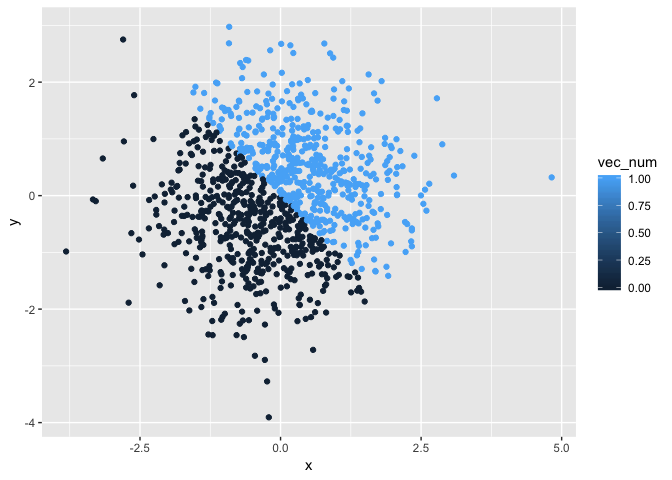
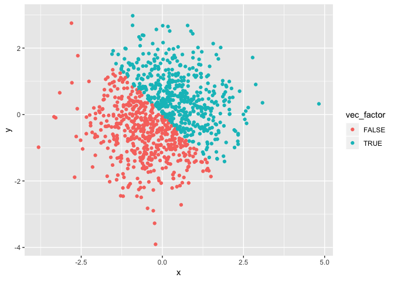

P8105\_hw1\_lz586
================
Lyuou Zhang
9/16/2018

## Problem 1

``` r
df = tibble(
  r_samp = runif(10, min = 0, max = 5), 
  vec_logical = r_samp>2,
  vec_char = c('a','b','c','d','e','f','g','h','i','j'),
  vec_factor = factor(c('a','b','c','d','e','f','g','h','i','j'))
  )
mean(df$r_samp)
```

    ## [1] 2.849816

``` r
mean(df$vec_logical)
```

    ## [1] 0.6

``` r
mean(df$vec_char)
```

    ## Warning in mean.default(df$vec_char): argument is not numeric or logical:
    ## returning NA

    ## [1] NA

``` r
mean(df$vec_factor)
```

    ## Warning in mean.default(df$vec_factor): argument is not numeric or logical:
    ## returning NA

    ## [1] NA

I created the data frame called “df” as asked. I am able to take the
mean of the variable “r\_samp” and “vec\_logical” but not “vec\_char”
and “vec\_factor”. The reason is that R is only able to take the mean
for numeric and logical variables.

## Problem 2

``` r
df2 <- tibble(
  x = rnorm(1000),
  y = rnorm(1000),
  vec_logical = x + y > 0,
  vec_num = as.numeric(vec_logical),
  vec_factor = as.factor(vec_logical)
)
```

The size of the data frame is 1000, 5.  
The mean of variable x is -0.0404462.  
The median of variable x is -0.0325575.  
The proportion of cases for which the logical vector is TRUE is
0.494.

<!-- -->

    ## Saving 7 x 5 in image

<!-- --><!-- -->
